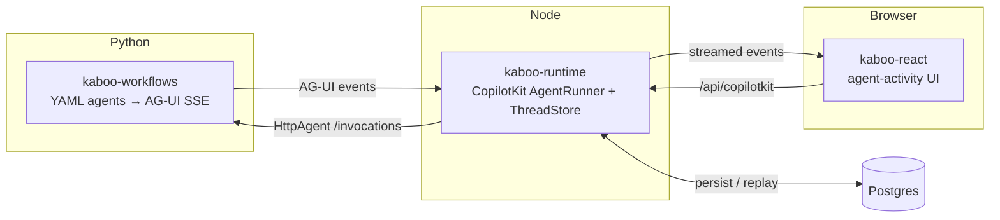

# The kaboo stack

**kaboo** is a small stack for building multi-agent apps with live, inspectable
agent activity: define agents in YAML and serve them as AG-UI SSE
(**kaboo-workflows**), persist and replay the full event log inside a CopilotKit
runtime (**kaboo-runtime**), and render hierarchical agent activity with
drill-down and human-in-the-loop in React (**kaboo-react**). The
**kaboo-workflows-demo** assembles all three into a runnable reference.

## Libraries

- :material-language-python: __kaboo-workflows__ — YAML multi-agent orchestration
  → AG-UI SSE (Python / PyPI).

    [Docs](https://gl-pgege.github.io/kaboo-workflows/) · [Repo](https://github.com/gl-pgege/kaboo-workflows)

- :material-database: __kaboo-runtime__ — CopilotKit runtime persistence: a custom
  `AgentRunner` + pluggable `ThreadStore` that replays the full event log.

    [Docs](https://gl-pgege.github.io/kaboo-runtime/) · [Repo](https://github.com/gl-pgege/kaboo-runtime)

- :material-react: __kaboo-react__ — React components + hooks for live,
  hierarchical agent activity inside a CopilotKit chat.

    [Docs](https://gl-pgege.github.io/kaboo-react/) · [Repo](https://github.com/gl-pgege/kaboo-react)

- :material-flask: __kaboo-workflows-demo__ — a runnable, end-to-end
  market-research demo wiring the three libraries together.

    [Repo](https://github.com/gl-pgege/kaboo-workflows-demo)

## Run the demo

The fastest way to see the whole stack in action is the demo — a market-research
assistant with delegated sub-agents, human-in-the-loop approvals, and full replay
across reloads.

1. Clone [kaboo-workflows-demo](https://github.com/gl-pgege/kaboo-workflows-demo).
2. Follow the
   [validated startup](https://github.com/gl-pgege/kaboo-workflows-demo#run-it-validated-startup):
   Postgres via Docker, then the pipeline (`:8080`), backend (`:4000`), and
   frontend (`:3000`).
3. Open <http://localhost:3000> and ask it to research a market.

## Contributing

One shared model spans every repo — see
[Contributing to the kaboo stack](contributing.md).
