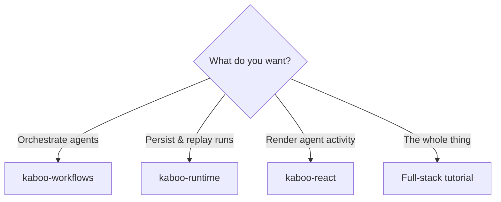
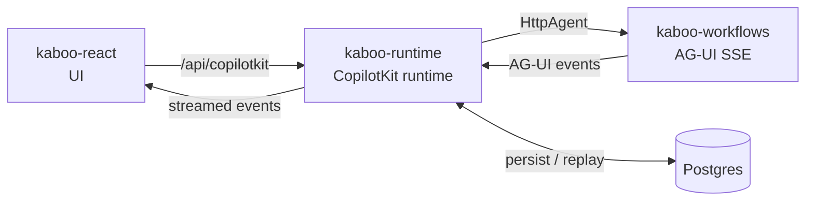

# Start here

kaboo is three libraries that snap together. Pick the path that matches what you
want to build — you can always add the others later.

## I want to orchestrate agents

Define models, agents, tools, MCP servers, and multi-agent orchestrations
(delegate / swarm / graph / parallel / nested) in **YAML**, then serve them as an
AG-UI SSE endpoint. `load()` returns plain `strands` objects, so you can also
drive agents in-process.

→ [kaboo-workflows](https://gl-pgege.github.io/kaboo-workflows/) ·
[Getting started](https://gl-pgege.github.io/kaboo-workflows/getting-started/)

## I want to persist and replay runs

Drop a plugin into a **CopilotKit runtime** (NestJS or any Node framework) that
records the full event log per thread and replays it on reconnect — so a browser
refresh mid-run or post-run restores exactly what happened. Ships an
`InMemoryThreadStore` and a `PostgresThreadStore`.

→ [kaboo-runtime](https://gl-pgege.github.io/kaboo-runtime/) ·
[Concepts](https://gl-pgege.github.io/kaboo-runtime/concepts/)

## I want to render agent activity

Drop-in **React** components + hooks that turn the AG-UI run stream into a live,
hierarchical activity tree with drill-down and human-in-the-loop, inside a
CopilotKit chat.

→ [kaboo-react](https://gl-pgege.github.io/kaboo-react/) ·
[Concepts](https://gl-pgege.github.io/kaboo-react/concepts/)

## I want the whole stack

Wire all three end-to-end: YAML agents → served over AG-UI → persisted in a
CopilotKit runtime → rendered in React, backed by Postgres.

→ [Full-stack tutorial](full-stack-tutorial.md)

## How they fit together

